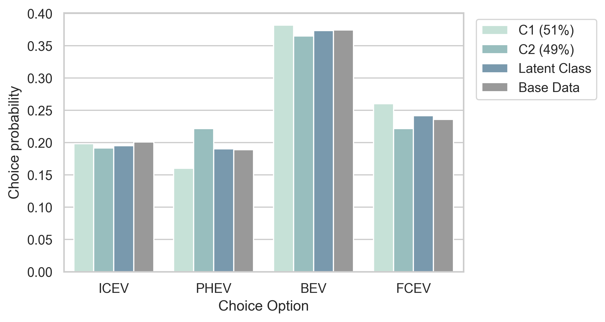

# Summary

MO|DE.behave is a python-based software package for the estimation and 
simulation of discrete choice models. The purpose of this software is to enable 
a rapid workflow for the quantitative analysis of survey data on the choice 
behavior of individuals or groups, utilizing advanced discrete choice methods. 
Therefore, MO|DE.behave incorporates estimation routines for conventional 
multinomial logit models as well as for mixed logit models with nonparametric 
distributions [@Train2009; @McFadden2000]. Since the estimation of this type of 
mixed logit model can be computationally expensive, the software facilitates the 
use of GPU-hardware during the estimation process to decrease computation time. 
Furthermore, MO|DE.behave contains a set of post-processing tools to visualize 
the estimation results and simulated choice probabilities, to identify consumer 
groups and to calculate model sensitivities. Additionally, pre-estimated 
discrete choice simulation methods for transportation research are included to 
enrich the software package for this specific community.

# Statement of need

The analysis of choice behavior is an important element in economic research as 
well as in related fields, such as the social sciences or civil engineering. 
Discrete choice theory is the mathematical foundation for the analysis of 
individual and aggregate choice behavior, which became widely established since 
the publication of seminal theoretical works in the 1970s in the context of 
transport-related research questions [@BenAkiva1973; @BenAkiva1985; @Train1985; @McFadden1976]. 
Examples of typical choice situations are the choice of an households’ 
energy supplier, the purchase of a new car or the study of political sentiment. 
In recent years, a new modeling approach in the field of discrete choice theory 
became popular – the mixed logit model [@Train2008; @Train2016]. 
Conventional discrete choice models only have a limited capability to describe 
the heterogeneity of choice preferences within a base population. 
I.e., divergent choice behavior of different individuals or consumer groups can 
only be studied to a limited degree. Mixed logit overcomes this deficiency and 
allows for the analysis of preference distributions across the base population.

MO|DE.behave complements already available python 
[@Arteaga2022; @Bierlaire2020; @Brathwaite2020] and R 
[@Croissant2020; @Hess2021; @Molloy2021] software packages for the estimation 
of discrete choice models. However, it is the first to provide functionality 
for the estimation of mixed logit models with nonparametric distributions. 
Additionally, it incorporates post-processing tools to enable a rapid analysis 
and application of the estimated choice models as well as ready-to-apply 
simulation methods for the specific field of transportation research.

# Use Cases and Outlook

Until now, MO|DE.behave has only been used internally at the Institute for 
Techno-economic Systems Analysis (IEK-3) at the Forschungszentrum Jülich GmbH 
(Juelich Research Center), Germany. Primary applications took place in the 
field of transportation research [@Reul2022]. 
However, the software’s application is not limited to this research field. 
MO|DE.behave is a generally applicable framework for the rapid quantitative 
analysis of choice behavior, based on discrete choice theory. 
A typical use case is the analysis of survey data, including the following steps:
1. Preparation of the survey data according to the input format, specified in the repository’s documentation.
2. Selection of model attributes and specification of model parameters.
3. Estimation of a multinomial or mixed logit model.
4. Visualization of estimated model parameters, simulated choice probabilities, identified consumer groups and calculated model sensitivities. 
The publication of MO|DE.behave aims to ease the application of discrete choice 
models, especially regarding the less documented mixed logit model with 
nonparametric design, for any researcher with an interest in choice modeling.
Further developments of the presented software package might integrate 
estimation routines for other discrete choice models, such as mixed logit with parametric distributions (e.g., normal distribution). We encourage an active participation in the software development process to adapt it to the user’s needs.

# Exemplary Visualizations

The presented software package contains an application script 
(mode_behave_public/Deployments/example_estimation.py), 
which exemplifies the workflow for the estimation of a multinomial and a 
mixed logit model based on a subsample of survey data, describing the car 
purchase behavior of households regarding different drive technologies. 
The available choice alternatives are internal combustion engines (ICEV), 
plug-in hybrid electric vehicles (PHEV), battery electric vehicles (BEV) and 
fuel cell electric vehicles (FCEV). 
Figure 1 and Figure 2 are created by post-processing methods, which are 
included in the software package.

Figure 1 visualizes the simulated choice probabilities for each drive technology 
as well as the choice probabilities according to the survey (base) data itself. 
The bar in light petrol green (left bar for each choice alternative) indicates 
the choice probabilities simulated by a multinomial logit (MNL-)model on the 
base data, while the blue bar (middle bar for each choice alternative) 
visualizes the choice probabilities for a scenario with decreased purchase 
costs of electric vehicles. The simulated probabilities indicate increased 
choice probabilities for the electrified drive technologies BEV and FCEV in 
case of reduced purchase costs.

Figure 2 shows the simulated choice probabilities for two identified consumer 
groups (C1 and C2) in petrol green (the two left bars for each choice alternative), 
relative to the choice probabilities of a combined latent class model in blue 
(third bar from the left for each choice alternative) and the survey (base) 
data in grey. According to the visualized choice probabilities, 
consumer group C1 indicates slightly higher choice probabilities for the 
electrified drive technologies BEV and FCEV compared to consumer group C2, 
the latent class model and the base data.

# Acknowledgements

The contributions to this paper are listed according to CRediT-taxonomy.

Julian Reul: Methodology, software, validation, formal analysis, data curation, 
writing – original draft.

Dr. Thomas Grube: Conceptualization, writing – review and editing, supervision, 
project administration, funding acquisition.
 
Prof. Dr. Jochen Linßen: Conceptualization, writing – review and editing, 
supervision, project administration, funding acquisition.

Prof. Dr. Detlef Stolten: Conceptualization, supervision, 
project administration, funding acquisition.

The authors declare that they have no known competing financial interests or 
personal relationships that could have appeared to influence the work reported 
in this paper.

Funding: This work was supported by the Helmholtz Association of German Research Centers.

# References