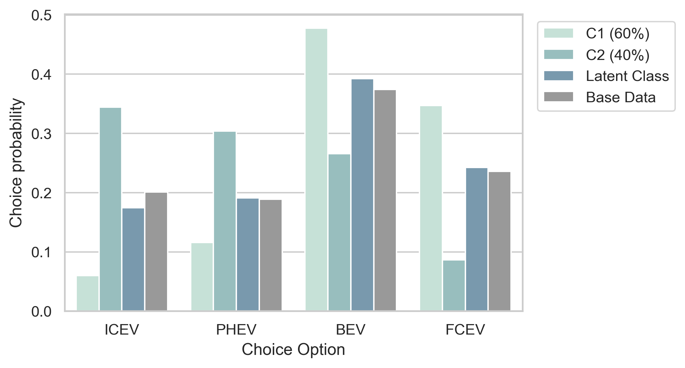

# Summary

MO|DE.behave is a Python-based software package for the estimation and 
simulation of discrete choice models. The purpose of this software is to enable 
the rapid quantitative analysis of survey data on choice behavior, 
utilizing advanced discrete choice methods. 
Therefore, MO|DE.behave incorporates estimation routines for conventional 
multinomial logit models, as well as for mixed logit models with nonparametric 
distributions [@Train2009; @McFadden2000]. As the estimation of this type of 
mixed logit model can be computationally-expensive, the software makes use
of latin hypercube sampling to increase the efficiency of the expectation 
maximization algorithm during the estimation process in order to decrease 
computation time. 
Furthermore, MO|DE.behave contains a set of post-processing tools for visualizing 
estimation and simulated results. Additionally, pre-estimated 
discrete choice simulation methods for transportation research are included to 
enrich the software package for this specific community.

# Statement of Need

The analysis of choice behavior is an important element in economic research, as 
well as in related fields, such as the other social sciences or civil engineering. 
Discrete choice theory is the mathematical foundation for the analysis of 
individual and aggregate choice behavior, which became widely established following 
the publication of seminal theoretical works in the 1970s in the context of 
transport-related research questions [@BenAkiva1973; @BenAkiva1985; @Train1985; @McFadden1976]. 
Examples of typical choice situations are the choice of a household's 
energy supplier, the purchase of a new car or the evaluation of political sentiment. 
In recent years, a new modeling approach in the field of discrete choice theory 
became popular – the mixed logit model [@Train2008; @Train2016]. 
Conventional discrete choice models only have a limited capability to describe 
the heterogeneity of choice preferences within a base population, i.e., 
the divergent choice behavior of different individuals or consumer groups can 
only be studied to a limited degree. Mixed logit models overcome this deficiency and 
allow for the analysis of preference distributions across base populations.
Nonparametric mixed logit models bear the specific advantage - in contrast
to parametric mixed logit models - that the form of the studied preference 
distribution, e.g. a normal distribution, is not exogenously defined by the
researcher, but endogenously derived from the data.

MO|DE.behave complements already available Python 
[@Arteaga2022; @Bierlaire2020; @Bierlaire2003; @Brathwaite2020] and R 
[@Croissant2020; @Hess2021; @Molloy2021] software packages for the estimation 
of discrete choice models. However, it is the first to provide functionality 
for the estimation of mixed logit models with nonparametric distributions. 
Additionally, it incorporates post-processing tools to enable the rapid analysis 
and application of the estimated choice models, as well as ready-to-apply 
simulation methods for the specific field of transportation research.

# Use Cases and Outlook

Until now, MO|DE.behave has only been used internally at the Institute for 
Techno-economic Systems Analysis (IEK-3) at the Forschungszentrum Jülich GmbH 
(Juelich Research Center). Primary applications have been in the 
field of transportation research [@Reul2022, @Reul2023]. 
However, the software’s use is not limited to this research field. 
MO|DE.behave is a generally applicable framework for the rapid quantitative 
analysis of choice behavior, based on discrete choice theory. 
A typical use case is the analysis of survey data, and includes the following steps:

 1. Preparation of the survey data according to the input format, specified in the repository’s documentation (long data format).
 2. Selection of model attributes and specification of the model's parameters.
 3. Estimation of a multinomial or mixed logit model.
 4. Analysis and visualization of the estimated model parameters and simulation results. 

The publication of MO|DE.behave aims to ease the application of discrete choice 
models, especially regarding the less documented mixed logit model with 
nonparametric design, for any researcher with an interest in choice modeling.
Further developments of the presented software package will integrate 
estimation routines for other discrete choice models, such as mixed logit with 
parametric distributions (e.g., normal distribution). 
We encourage active participation in the software development process to adapt 
it to user needs.

# Typical Visualizations

The presented software package contains an application script 
(mode_behave_public/Deployments/example_estimation.py), 
which exemplifies the workflow for the estimation of a multinomial and 
mixed logit model based on a subsample of survey data, describing the car 
purchasing behavior of households with respect to different drive technologies.
The original data was collected in autumn 2021 in a nationally representative
survey among 451 German households that indicated a willingness to buy a new vehicle.
The available choice alternatives are internal combustion engines vehicles (ICEVs), 
plug-in hybrid-electric vehicles (PHEVs), battery-electric vehicles (BEVs) and 
fuel cell-electric vehicles (FCEVs).

Figures 1 and 2 were created using a post-processing method (.forecast()), 
which is included in the software package.

Figure 1 visualizes the simulated choice probabilities for each drivetrain technology, 
as well as the choice probabilities according to the survey (base) data itself. 
The bar in light petrol green (left bar for each choice alternative) indicates 
the choice probabilities simulated by a multinomial logit model on the 
base data, whereas the blue bar (middle bar for each choice alternative) 
visualizes the choice probabilities for a scenario with decreased purchasing 
costs of electric vehicles. The simulation results indicate increased 
choice probabilities for the electrified drivetrain technologies of BEVs and FCEVs in 
the case of reduced purchasing costs for electric vehicles.

Figure 2 shows the simulated multinomial logit choice probabilities for two identified consumer 
groups (C1 and C2) in petrol green (the two left bars for each choice alternative)
relative to the choice probabilities of a combined latent class model in blue 
(third bar from the left for each choice alternative) and the survey (base) 
data in gray. The latent class model indicates the average multinomial logit choice probabilities 
of the identified consumer groups, weighted by their size.
In turn, the choice preferences of the consumer groups C1 and C2 are derived 
from a preceding cluster analysis of a preference distribution, 
found by a mixed logit model with nonparametric design. 
According to the visually-depicted simulation results, 
consumer group C1 indicates significantly higher choice probabilities for the 
electric drivetrain technologies of BEVs and FCEVs compared to consumer group C2, 
the latent class model and the base data.

Electric vehicle adoption is a prominent example of behavioral modeling in 
socio-technical systems, with recent research being conducted in the German
context by Gnann et al. (2022) and Reul et al. (2023) [@Gnann2022, @Reul2023].  

# Acknowledgements

The contributions to this paper are listed according to CRediT-taxonomy.

Julian Reul: Methodology, software, validation, formal analysis, data curation, 
writing – original draft.

Dr. Thomas Grube: Conceptualization, writing – review and editing, supervision, 
project administration, funding acquisition.
 
Prof. Dr. Jochen Linßen: Conceptualization, writing – review and editing, 
supervision, project administration, funding acquisition.

Prof. Dr. Detlef Stolten: Conceptualization, supervision, 
project administration, funding acquisition.

The authors declare that they have no known competing financial interests or 
personal relationships that could have appeared to influence the work reported 
in this paper.

Funding: This work was supported by the Helmholtz Association of German Research Centers.

# References